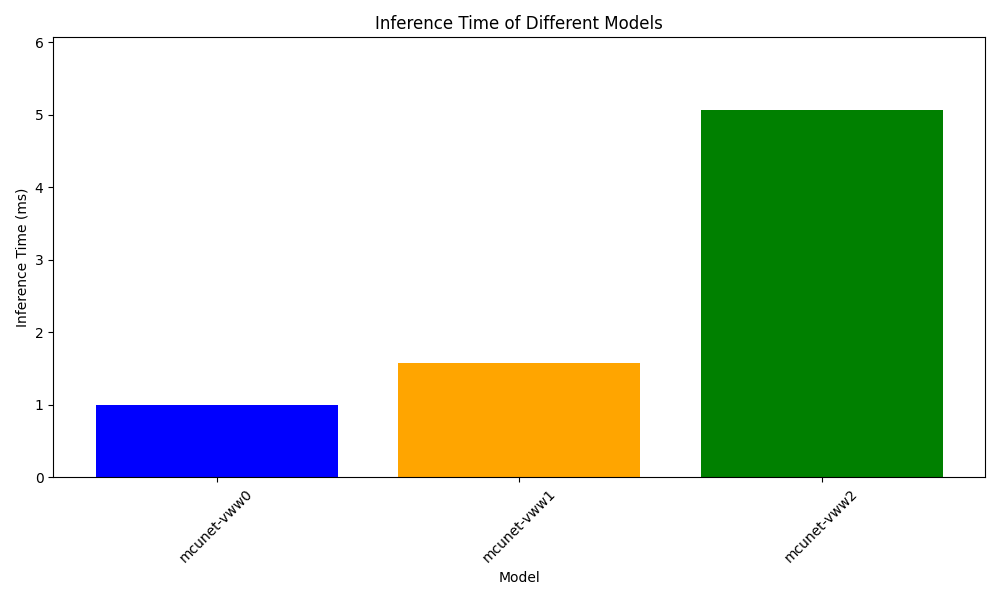
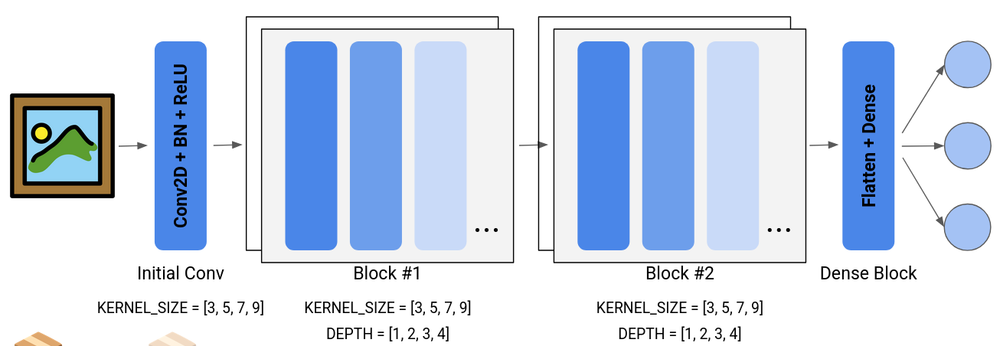
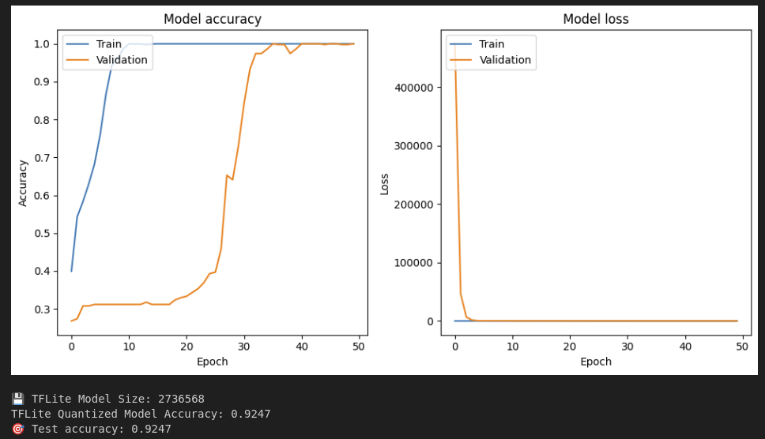
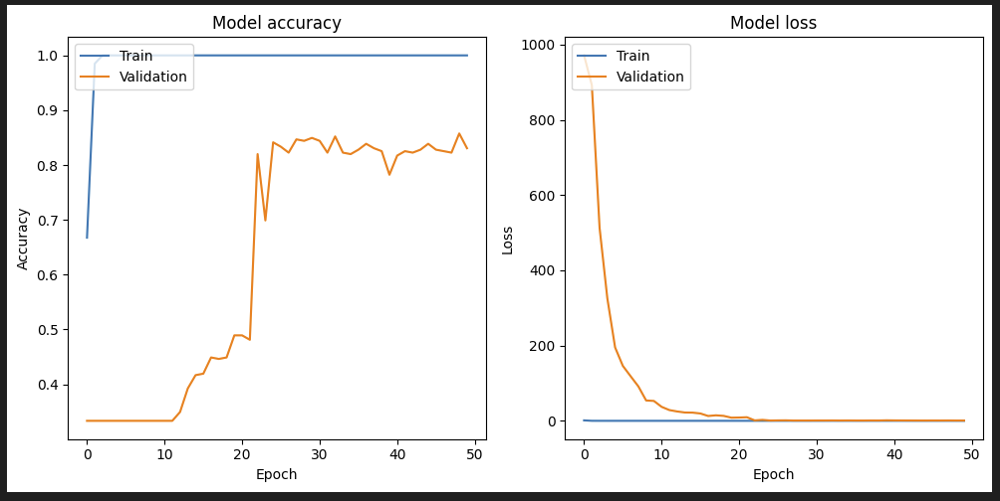
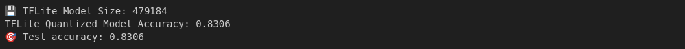

# MCUNet Reproduction: Tiny Deep Learning on IoT Devices

This project began as a reproduction of the **MCUNet** paper:
> *"MCUNet: Tiny Deep Learning on IoT Devices" (NeurIPS 2020)* by Ji Lin et al.

Our original focus was on deploying deep learning models on resource-constrained microcontrollers, specifically targeting the **Visual Wake Words (VWW)** task (i.e., person detection). Midway through, we pivoted based on practical challenges and resource constraints. The revised project focuses on re-implementing the **TinyNAS** component and demonstrating its adaptability to alternate datasets and toolchains.

---

## 📌 Objectives

- Reproduce MCUNet's person detection task using **TinyNAS** and **TinyEngine**
- **(Achieved)** Replicate model zoo results for VWW and run models on benchmark dataset
- **(Pivot)** Address deployment issues when integrating camera input on STM32
- Refocus on implementing and experimenting with the **TinyNAS** component
- Demonstrate the flexibility of TinyNAS by adapting it to:
   - A **ResNet-style backbone**
   - A **TensorFlow Lite** optimization pipeline
   - A lightweight **Rock-Paper-Scissors** dataset
- Document the process, highlight lessons learned, and evaluate modularity of MCUNet components

---

## 🔧 Methodology

1. **Literature and Code Review**
   - Analyze the MCUNet paper and official GitHub repository
2. **Initial Reproduction**
   - Successfully reproduced VWW model results using pre-trained models
3. **Deployment Challenge**
   - Encountered persistent issues running camera-integrated inference on STM32
4. **Pivot and Refocus**
   - Shifted effort to study and adapt TinyNAS to a custom training and deployment pipeline
   - Used TensorFlow Lite for deployment to avoid needing to learn TinyEngine internals
   - Switched to Rock-Paper-Scissors dataset for simplified data collection and training
5. **Experimentation**
   - Modified search space and architecture within TinyNAS to evaluate backbone flexibility

---

## 📦 Outcomes

- ✅ Reproduced VWW results using model zoo and deployed on STM32 (no camera)
- ✅ Identified limitations of TinyEngine integration with camera input on STM32
- ✅ Re-implemented TinyNAS with custom backbone and dataset
- ⚡ Demonstrated TinyNAS’s adaptability to alternate backbones, datasets, and toolchains

---

## 👥 Team

- **Devin Setiawan** – Focus on TinyNAS
- **Vinayak Jha** – Focus on Edge Deployment

---

## 📚 References

- Lin, Ji, et al. "[MCUNet: Tiny Deep Learning on IoT Devices](http://arxiv.org/abs/2007.10319)," arXiv 2020.
- [Official GitHub Repository](https://github.com/mit-han-lab/mcunet)

---

# Results

We split the replcation into three phases:
1. **Phase 1 - Running Eval:** We evaluated MCUNet’s pre-trained models on the Visual Wake Words dataset and successfully reproduced the reported accuracy results, confirming the correctness of the model zoo.
2. **Phase 2 - Edge Deployment:** We deployed the evaluated models onto an STM32 microcontroller, achieving functional inference on-device without a camera input, due to hardware and driver constraints.
3. **Phase 3 - TinyNAS:** We re-implemented the TinyNAS pipeline using a ResNet-style backbone and TensorFlow Lite, demonstrating its adaptability to different architectures, optimizers, and datasets.

---

# 🦒 Phase 1 - Running Eval
## 1. Environment Setup 🐍
You can use either Conda or venv to set up Python 3.12.3.
### Using Conda
```bash 
conda create -n myEnv python=3.12.3 -y 
conda activate myEnv
```
### Using venv
```bash 
python3.12 -m venv myEnv
source myEnv/bin/activate # On Windows use: myEnv\Scripts\activate
```
### Install the requirements needed
```bash 
pip install -r requirements.txt
```

---

## 2. Running the code 🏃
To run the code for visual wake word task, run the following command:
```bash 
python eval_tflite.py --net_id mcunet-vww0 --dataset vww --data-dir dataset/vww-s256/val
```

Code to generate inference time graph:
```bash 
python generate_graph.py
```
### Fig 1. Inference Time Graph


# 🖥️ Phase 2 - Edge Deployment

In this phase, we deployed the evaluated MCUNet models to an STM32 microcontroller and successfully ran inference without camera input due to hardware limitations.  
**Note:** The code for this phase is not included in this repository, as we closely followed the official deployment tutorial provided in the [TinyEngine inference guide](https://github.com/mit-han-lab/tinyengine/tree/main/tutorial/inference).

### Fig 2. Edge Deployment on STM32


---

# 🔎 Phase 3 - TinyNAS

In this phase, we re-implemented the TinyNAS pipeline using a ResNet-style backbone and TensorFlow Lite for deployment.  
The model used for the results shown in this project is saved as `supernetwork.keras` (the over-parameterized search space) and `best_model.keras` (the final selected architecture).  
Detailed implementation and training steps can be found in `TinyNASTraining.ipynb`. All training was conducted on a Google Colab instance with an A100 GPU.

### Fig 2. Network Architecture


### Fig 3. Super-Network Training


### Fig 4. Sub-Network Training



📊 **Note:** Additional figures—such as evolution algorithm results, search space optimization visualizations, and training metrics—are available in the `TinyNASTraining.ipynb` notebook.


